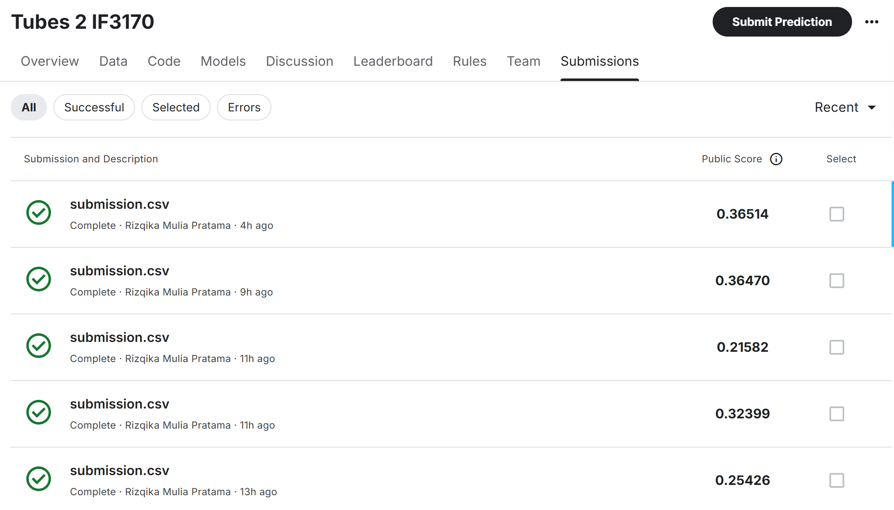

<h3 align="center">Tugas Besar 2 IF3170 Intelijensi Artifisial</h3>
<h1 align="center">Machine Learning Algorithm Implementation 📈📊</h1>

<div align="center">
  
</div>

## 👷‍♂️ Pembagian Kerja 
<table border="1">
  <thead>
    <tr>
      <th>NIM</th>
      <th>Nama</th>
      <th>Pekerjaan</th>
    </tr>
  </thead>
  <tbody>
    <tr>
      <td>13522124</td>
      <td>Aland Mulia Pratama</td>
      <td>Implementasi Algoritma KNN dan Naive Bayes. Modifikasi Preprocessing dan Fungsi Confusion Matrix. Modifikasi Algoritma KNN (performa waktu). Mengerjakan Error Analysis. Pengerjaan laporan BAB III dan BAB IV.</td>
    </tr>
    <tr>
      <td>13522126</td>
      <td>Rizqika Mulia Pratama</td>
      <td>Implementasi Algoritma KNN dan Gaussian Naive Bayes, Data Preprocessing (Handling Outliers, Data Normalization, Feature Encoding, Feature Scaling, Feature Selection), Pipelining, Modeling, Validation, Model Save, Model Load.</td>
    </tr>
    <tr>
      <td>13522135</td>
      <td>Christian Justin Hendrawan</td>
      <td>Mengerjakan bagian cleaning data : Handle Missing Value dan Feature Engineering, mengimplementasikan Network Dimensionality Reducer, dan mengimplementasikan ID3. Pengerjaan Laporan BAB I dan BAB II.</td>
    </tr>
    <tr>
      <td>13522148</td>
      <td>Auralea Alvinia Syaikha</td>
      <td>Mengerjakan bagian cleaning data (handle missing values, outlier, handling duplicates), bagian preprocessing (feature encoding, feature scaling, handle imbalance dataset), serta memodif pipeline. Mengerjakan laporan bagian analisis prediksi KNN.</td>
    </tr>
  </tbody>
</table>

## ️🖥️ Deskripsi Umum
Tugas ini bertujuan untuk mengimplementasikan algoritma pembelajaran mesin K-Nearest Neighbors (KNN), Gaussian Naive-Bayes, dan ID3 (Iterative Dichotomiser 3) dari awal (from scratch) untuk mengklasifikasikan data lalu lintas jaringan dari dataset UNSW-NB15 yang mencakup serangan siber dan aktivitas normal. Selain implementasi manual, algoritma juga akan diimplementasikan menggunakan pustaka scikit-learn untuk perbandingan kinerja. Algoritma yang dibuat harus dapat disimpan dan dimuat kembali, serta hasil prediksi dapat dikirimkan ke platform Kaggle untuk evaluasi. Proses ini melibatkan tahapan pembersihan dan transformasi data, pemilihan fitur, serta reduksi dimensi, diikuti dengan pelatihan dan validasi model menggunakan metode seperti train-test split atau k-fold cross-validation. Notebook yang dikumpulkan harus dapat mereproduksi hasil prediksi yang konsisten dengan submisi Kaggle, dengan hanya model KNN, Naive Bayes, dan ID3 hasil implementasi from scratch yang diperbolehkan digunakan.

## 🆚 Versi Notebook
### notebook-v1
Notebook-v1 menampilkan pendekatan yang eksplisit dan rinci dalam pengolahan data untuk membangun model pembelajaran mesin. Pada tahap awal, dilakukan pembersihan data seperti penghilangan duplikasi menggunakan RemoveDuplicates(), diikuti oleh pipeline pemrosesan data yang mencakup penanganan nilai hilang, encoding variabel kategori, normalisasi, dan seleksi fitur dengan memilih 20 fitur terbaik. Setelah melalui pipeline, data dibagi menjadi set pelatihan dan validasi menggunakan train_test_split, dengan proses resampling menggunakan SMOTE untuk mengatasi ketidakseimbangan kelas pada data latih. Notebook ini juga menggunakan NetworkDimensionalityReducerPipeline untuk mengurangi dimensi fitur menjadi 15 komponen, memberikan model akses ke representasi data yang lebih terkompresi dan informatif. Pendekatan ini memprioritaskan langkah-langkah pemrosesan manual dengan fokus pada penanganan masalah ketidakseimbangan kelas dan optimalisasi fitur sebelum proses pelatihan model dimulai.

### notebook-v2
Notebook-v2 mengadopsi pendekatan yang lebih modular dan fleksibel dengan menggunakan pipeline yang dapat dikonfigurasi. Pipeline ini terdiri dari beberapa langkah, dimulai dengan pemrosesan fitur melalui objek FeatureEngineering dan UNSWPreprocessor, yang mencakup pengolahan data dan reduksi dimensi menggunakan PCA untuk mengurangi jumlah fitur menjadi 15 komponen. Data dibagi menjadi set pelatihan dan validasi lebih awal, sebelum diproses melalui pipeline, dengan pembagian yang seimbang menggunakan train_test_split. Keunggulan notebook ini terletak pada penggunaan fungsi create_pipeline(), yang memungkinkan pemilihan model secara dinamis dan penerapan preprocessing yang lebih terstruktur dan terintegrasi. Pendekatan ini memberi fleksibilitas dalam eksperimen model, memungkinkan penyesuaian mudah pada parameter pipeline dan model, sambil memastikan pengolahan data dan reduksi dimensi dilakukan secara efisien sebelum pemodelan.

## 📃 Laporan
Dalam laporan ini, kami membahas tahapan pembersihan data, transformasi, pemilihan fitur, serta pelatihan dan validasi model, baik menggunakan implementasi manual (from scratch) maupun pustaka scikit-learn. Hasil eksperimen dan analisis dapat [diakses di sini](./docs/Tubes2-atk_hlic.pdf).


## Requirements 
1. Install python
   ```
   https://www.python.org/downloads/
   ```
2. Install all libraries
   ```
   pip install pandas numpy seaborn matplotlib scikit-learn
   ```


## How To use 🧑‍💻
1. Clone this repository
```
git clone https://github.com/rizqikapratamaa/Tubes2_AI_atk_hlic.git
```
2. Open the notebook (notebook-v2.ipynb) file
3. Run All
